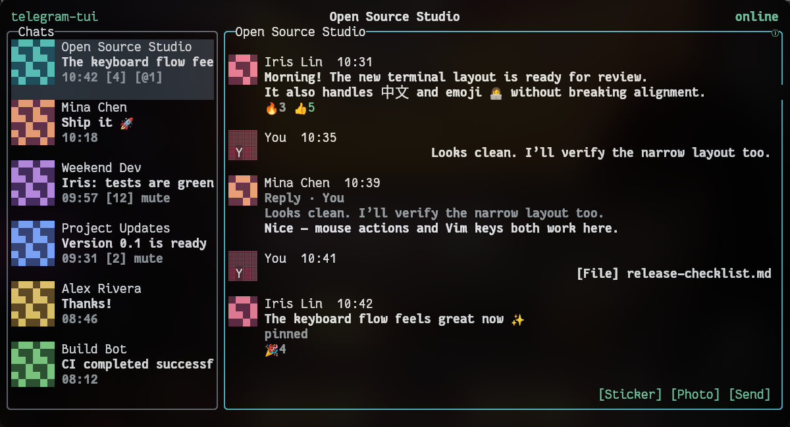

# telegram-tui

[](https://github.com/zylen-det/telegram-tui/actions/workflows/ci.yml)
[](LICENSE)

A Telegram client that lives in [Kitty](https://sw.kovidgoyal.net/kitty/). It is built with [Bubble Tea v2](https://github.com/charmbracelet/bubbletea) and [TDLib](https://github.com/tdlib/td), combining a responsive terminal UI, inline images, mouse support, desktop notifications, and a persistent Telegram session.

> **Project status:** telegram-tui is an early release for Arch Linux x86-64 and Kitty. It supports one Telegram account. Calls, stories, and multi-account use are not implemented yet.

telegram-tui is an unofficial client and is not affiliated with Telegram.



## Highlights

- Sign in with a phone number, verification code, and optional Telegram 2FA without leaving the TUI.
- Read and send messages in private chats, groups, supergroups, channels, and forum topics.
- Navigate with Vim keys, conventional keys, a mouse, or any combination of them.
- Search chats and messages, jump to unread or mentioned chats, browse pinned messages, and use bot-command completion.
- Reply, edit, delete, forward, pin, copy, and react to messages when Telegram permits the action.
- Keep Telegram cloud drafts—including reply targets—synchronized across devices.
- Send photos, videos, audio, documents, and stickers. Preview images and available thumbnails inline as terminal pixel cells, or view images at full fidelity through Kitty's graphics protocol; other media opens in the system application.
- Browse members and use supported group/channel administration controls.
- Continue reading cached content offline and reconnect without losing the active view.
- Use a transparent terminal canvas that follows Kitty's configured background opacity.

## Requirements

The packaged release currently targets:

- Arch Linux on x86-64
- Kitty
- the `gcc-libs`, `openssl`, and `zlib` runtime packages
- a personal Telegram `api_id` and `api_hash` from <https://my.telegram.org/apps>

Desktop notifications are optional and require a freedesktop-compatible notification daemon such as Mako, Dunst, or SwayNotificationCenter.

## Install

Install the latest release without `sudo`:

```bash
curl -fsSL https://raw.githubusercontent.com/zylen-det/telegram-tui/main/scripts/install.sh | sh
```

The installer verifies the release checksum, places versioned files under `~/.local/opt/telegram-tui`, and links the executable as `~/.local/bin/telegram-tui`. If necessary, add that directory to `PATH`:

```bash
export PATH="$HOME/.local/bin:$PATH"
```

Install a specific version or use another prefix:

```bash
curl -fsSL https://raw.githubusercontent.com/zylen-det/telegram-tui/main/scripts/install.sh \
  | VERSION=v0.1.0 PREFIX="$HOME/.local" sh
```

You can also download the archive and `SHA256SUMS` from [GitHub Releases](https://github.com/zylen-det/telegram-tui/releases), verify it, and run it in place:

```bash
sha256sum --check SHA256SUMS
tar -xzf telegram-tui_<version>_linux_x86_64.tar.gz
./telegram-tui_<version>_linux_x86_64/telegram-tui
```

Keep the archive's `lib` directory beside the executable; it contains the matching TDLib shared library.

## First run

Start the client:

```bash
telegram-tui
```

On first launch, enter your Telegram application credentials, phone number, login code, and—if enabled—2FA password in the TUI. The application credentials and a generated TDLib database key are saved in `config.toml` with mode `0600`; login codes and passwords are not saved.

For one-off launches, application credentials may be supplied through the environment:

```bash
TELEGRAM_API_ID=12345 TELEGRAM_API_HASH=... telegram-tui
```

Credential lookup order is environment → config file → first-run prompt.

## Everyday controls

| Action | Keys | Mouse |
|---|---|---|
| Move chat focus / list selection | `j` / `k` or Up / Down | Click a row or use the wheel |
| Move between panes | `h` / `l` or Shift-Tab / Tab | Click a pane |
| Open focused chat actions / activate | Enter | Click the action |
| Close or go back | Esc; `q` inside a modal | Click close or outside |
| Open chat details | `i` or F2 | Click Info |
| Search from the chat list | `/` | Click a result |
| Next unread / mentioned chat | `u` / `m` in the chat list | — |
| View pinned messages | `p` in a conversation | — |
| Browse forum topics | `t` | Click a topic |
| Page through history | Ctrl-u / Ctrl-d or Page Up / Page Down | Use the wheel |
| Send a message | Enter | Click Send |
| Insert a newline | Shift-Enter | — |
| Send media or a document | Ctrl+O | Click `[Photo]` |
| Open the sticker picker | Ctrl+S | Click `[Sticker]` |
| Stop the application | Ctrl-C | — |

Moving through the chat list changes the focused row without replacing the selected conversation. Press Enter for actions on the focused chat, then choose **Open chat** to make it the selected conversation.

Typing `/` at the beginning of the composer opens bot-command completion where available. Plain `q` never quits the process; it only closes the current modal or page.

Command-line help and version information are available without starting the TUI:

```bash
telegram-tui --help
telegram-tui --version
```

## Layout and appearance

The interface adapts to the terminal size:

- **Wide:** 120×24 or larger, with chat and conversation panes plus optional details.
- **Normal:** 80–119 columns and at least 20 rows.
- **Narrow:** 60–79 columns and at least 18 rows, using separate pages.
- **Too small:** below 60×18, where the application preserves state and asks for more room.

telegram-tui uses the terminal's default background. Configure translucency in Kitty—for example, `background_opacity 0.9`—rather than in the application.

## Local data and privacy

| Data | Default location |
|---|---|
| Preferences and credentials | `~/.config/telegram-tui/config.toml` |
| Application state and log | `~/.local/state/telegram-tui/` |
| TDLib database | `~/.local/share/telegram-tui/tdlib/database/` |
| Downloaded avatar files | `~/.cache/telegram-tui/avatars/files/` |
| Disposable pixel cache | `~/.cache/telegram-tui/avatars/pixels/` |

The corresponding XDG environment variables override these roots. Removing the avatar cache does not remove the Telegram session.

Logs are rotating and restricted to an allow-list. They do not contain credentials, message or draft text, Telegram payloads, local media paths, commands, or raw errors.

## Known limitations

- Packaged releases currently support only Linux x86-64 and Kitty.
- Only one Telegram account is supported.
- Calls and stories are not implemented.
- Topic administration, advanced invite-link options, join-request moderation, and timed restrictions remain on the roadmap.
- Some recently implemented group/channel controls and topic flows still need broader real-account manual acceptance; see [`docs/manual-acceptance.md`](docs/manual-acceptance.md).

## Build from source

Install the Go/CGO toolchain and runtime dependencies:

```bash
sudo pacman -S --needed base-devel openssl zlib go git curl kitty
```

Then clone the repository and build:

```bash
git clone https://github.com/zylen-det/telegram-tui.git
cd telegram-tui
make tdlib
make build
./bin/telegram-tui
```

`make tdlib` downloads and verifies the pinned prebuilt TDLib library. To compile that same TDLib commit locally instead:

```bash
sudo pacman -S --needed cmake gperf
make tdlib-source
make build
```

Neither path uses `sudo` inside the repository.

## Development and verification

Default tests do not require Telegram credentials, Kitty, or native TDLib:

```bash
make verify
```

Run the native integration and production build checks with:

```bash
make tdlib
make test-tdlib
make build
./bin/telegram-tui --version
git diff --check
```

See [`docs/architecture.md`](docs/architecture.md) for package boundaries and [`docs/manual-acceptance.md`](docs/manual-acceptance.md) for real-account checks.

For maintainers, a `v*` tag runs the release workflow and publishes a checksummed Linux x86-64 archive. The same artifact can be reproduced locally:

```bash
make tdlib
make package VERSION=v0.1.0
(cd dist && sha256sum --check SHA256SUMS)
```

## Roadmap

Near-term work focuses on richer group/channel administration: named or expiring invite links, join requests, timed restrictions, and topic administration. Longer-term possibilities include multiple accounts, additional terminal image protocols, macOS, calls, and stories.

## License

telegram-tui is available under the [MIT License](LICENSE). Release archives also include license material for TDLib, the prebuilt package, and Go dependencies.
